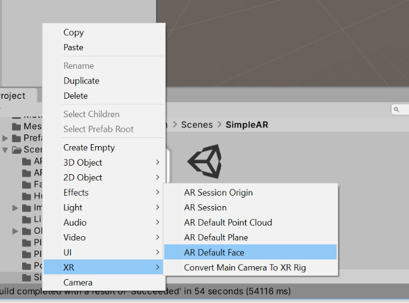
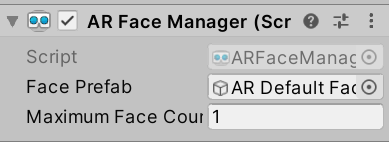

# Unity-echo3D-demo-Face filter

Simple Face filter demo with Unity and echo3D.

## Register

Don't have an API key? Make sure to register for FREE at [echo3D](https://console.echo3D.co/#/auth/register).

## Setup

### 1. Installing AR Foundation

To install AR Foundation through the Unity Package Manager, follow the instructions in the Unity documentation [here](https://docs.unity3d.com/Packages/com.unity.xr.arfoundation@3.1/manual/index.html).

### 2. Setup a simple AR application

Open the AR Foundation sample scene located in:

```
Assets > AR Foundation > Scenes > SimpleAR > SimpleAR
```


In the hierarchy click on the `AR Session Origin` game object.

In the inspector view, look for the `Place on Plane` script and set the `Placed Prefab` to the echo3D prefab in the `Assets > echo3D` folder.


### 3.  Adding AR Default Face
In the hierarchy, right click and choosr `XR-AR Default Face`



### 4.  Adding AR Face Manager and scripts
In the inspector view, click `Add component` and search for `AR Face Manager`and `CustomerBehaviour`. Then add` AR Default Face ` which we created previously to the `Face prefab`.



### 5.  Set your API key

Edit the echo3D prefab and set your API key through in the Inspector view.


### 6. Upload your face mask image to echo3D console


### 7. Change CustomBehaviour

Overwrite the existing *echo3D/CustomBehaviour.cs* script with the new CustomBehaviour.cs file

### 8. Run your application

Simply press the *Play* button in Unity. You can also build it in your phone.


## Learn More

Refer to our [documentation](https://docs.echo3D.co/unity/) to learn more about how to use Unity and echo3D.

## Support

Feel free to reach out at [support@echo3D.co](mailto:support@echo3D.co) or join our [support channel on Slack](https://go.echo3D.co/join).
